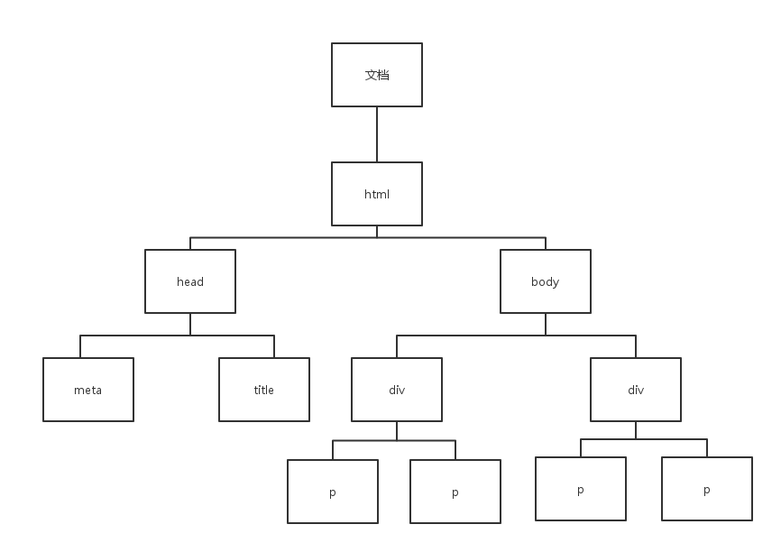

Title:DOM

[TOC]

# DOM
DOM的全称为**文档对象模型**,当一个页面被加载时浏览器就会创建相应的文档对象模型。
例如：
index.html
```html
<html>
<head lang="en">
    <meta charset="UTF-8">
    <title>文档对象模型</title>
</head>
<body>
    <div id="all1">
        <p id="first1"></p>
        <p id="second1"></p>
    </div>

    <div id="all2">
        <p id="first2"></p>
        <p id="second2"></p>
    </div>
</body>
</html>
```
那么它所对应的HTML DOM树就应该是：



## 主要作用

定义访问和处理HTML文档的方法，与页面进行交互，对HTML进行添加、改变、移除还可以改变节点的css样式。

##document

每个载入浏览器的HTML文档都会成为document对象。当我们想要通过脚本语言对HTML文档进行操作时我们就得通过document对象对HTML文档元素进行访问，它就是一个我们通过脚本语言控制HTML文档的接口。

###曾经遇到的小错误

在开始使用document对象的方法获取节点时碰到的一个问题就是当我将脚本语言在head中引入时，在script.js中写函数运行时，当写普通函数，然后调用时出现如下状况：
index.html
```html
<html>
<head lang="en">
    <meta charset="UTF-8">
    <title>文档对象模型</title>
    <script type="text/javascript" src="script.js"></script>
</head>
<body>
    <div id="all1">
        <p id="first1"></p>
        <p id="second1"></p>
    </div>

    <div id="all2">
        <p id="first2"></p>
        <p id="second2"></p>
    </div>
</body>
</html>
```
script.js
```javascript
function fun(){

    var d1=document.getElementById('all1');
    alert(d1);
}
fun();
```
效果图：

纠结郁闷一阵子后，发现有两个解决的办法

**1.将脚本引入放在文档的后面**
因为将脚本语言放在文档的最前的面，它先一步进行加载，而此时DOM还没有完全创建，当然获取不到节点内容了。
index.html
```html
<html>
<head lang="en">
    <meta charset="UTF-8">
    <title>文档对象模型</title>
</head>
<body>
    <div id="all1">
        <p id="first1"></p>
        <p id="second1"></p>
    </div>

    <div id="all2">
        <p id="first2"></p>
        <p id="second2"></p>
    </div>
</body>
<script type="text/javascript" src="script.js"></script>
</html>
```
script.js
```javascript
function fun(){

    var d1=document.getElementById('all1');
    alert(d1);
}
fun();
```
效果图：


**2.改变函数调用方法，此时会涉及到javascript中的onload事件，这个事件表示的意思是*当页面全部元素加载完成时触发*，由此可以知道它会等到文档页面元素加载完毕时才会执行。**
index.html
```html
    <html>
<head lang="en">
    <meta charset="UTF-8">
    <title>文档对象模型</title>
    <script type="text/javascript" src="script.js"></script>
</head>
<body>
    <div id="all1">
        <p id="first1"></p>
        <p id="second1"></p>
    </div>
    
    <div id="all2">
        <p id="first2"></p>
        <p id="second2"></p>
    </div>
</body>
</html>
```

script.js
```javascript
window.onload=function (){

    var d1=document.getElementById('all1');
    alert(d1);
};
```
效果图：


###获取节点的方法


* **通过id查找**   
  document.getElementById(id);
  这个方法就是通过节点的id获取节点，而id是唯一的，每个节点的id都是不一样的，所以不用担心会找错。
```javascript
var d1=document.getElementById('all1');
```


* **通过标签名查找**  
  document.getElementsByTagName(TagName);
  这个方法在我使用的时候发生过一点小小的意外，我第一次使用的时候就发现，为什么我明明写对了就是不出来结果呢？在无比纠结的情况下又删了打打了删，然后万般无奈下放到webstorm中发现不高亮显示，我就一个字母一个字母的看，原来它有‘s’。。。后来才领悟过来，一个文档里面当然会有相同的标签名称，所以我们通过这个获取的节点不是一个，所以它要有‘s’！而且它的返回值是**数组，可以通过访问数组的方法访问！**
  就像这样：
```javascript
var d2=document.getElementsByTagName('div');
    alert(d2);
```
效果图：

是一个集合,如果我们这样：
```javascript
var d2=document.getElementsByTagName('div')[1];
    alert(d2);
```
效果图：

这样我们就能找到自己想要的节点了。


* **通过name属性查找**  
  document.getElementsByName(name);
  这个方法是通过节点的name属性获取节点，返回的也是一个**数组**，因为不同的标签可以有相同的名字属性。

```html
<input name="a1" type="text">
```

```javascript
 var a1=document.getElementsByName('a1')[0];
    alert(a1);
```

效果图：


###节点的分类

元素节点、属性节点、文本节点、文档节点


###节点属性

* 节点名称：nodeName
  属性说明：返回一个字符串，给定节点的名字。**只读**
| 节点类型 |    返回值    |
| :--: | :-------: |
| 属性节点 |   属性名称    |
| 元素节点 |   元素名称    |
| 文本节点 |   #text   |
| 文档节点 | #document |

* 节点的值：nodeValue
  属性说明：返回给定节点当前的值
| 节点类型 |      返回值       |
| :--: | :------------: |
| 属性节点 |      属性的值      |
| 元素节点 | NUll或Undefined |
| 文本节点 |      文本自身      |

* 节点类型：nodeType
  属性说明：返回一个整数，代表给定节点的属性
| 节点类型 |    返回值     |
| :--: | :--------: |
| 属性节点 |     2      |
| 元素节点 |     1      |
| 文本节点 | IE：3  其他：7 |
| 文档节点 |     9      |
|  注释  |     8      |

​                   


​			 当然这些只是获取节点的方法，在以后的文章中我会总结一下操作节点的方法。